# Get ready: A new V8 is coming, Node.js performance is changing.
## How the performance characteristics of v8's Turbofan will affect the way we optimize

Authors: [David Mark Clements](https://twitter.com/davidmarkclem) and
[Matteo Collina](https://twitter.com/matteocollina)

Reviewers: [Franziska Hinkelmann](https://twitter.com/fhinkel) and
[Benedikt Meurer](https://twitter.com/bmeurer) from the V8 team.

Since it's inception Node.js has depended on the V8 JavaScript engine to provide
code execution in the language we all know and love. The V8 JavaScript engine is
a JavaScript VM written by Google for the Chrome browser. From the beginning,
a primary goal of V8 was to make JavaScript fast, or at least - faster than the competition.
For a highly dynamic, loosely typed language this is no easy feat.
This piece is about the evolution of V8 and JS engines performance.

A central piece of the V8 engine that allows it to execute JavaScript at high speed is
the JIT (Just In Time) compiler. This is a dynamic compiler that can optimize code during
runtime. When V8 was first built the JIT Compiler was dubbed: Crankshaft.

As an outside observer and user of JavaScript since the 90's, it has seemed that
fast and slow paths in JavaScript (whatever the engine may be) were often counter-intuitive, the
reasons for apparently slow JavaScript code were often difficult to fathom.

In recent years [Matteo Collina](https://twitter.com/matteocollina) and [I](https://twitter.com/davidmarkclem)
have focused on finding out how to write performant Node.js code. Of course this means
knowing which approaches are fast and which approaches are slow when our code executed by 
the V8 JavaScript engine.

Now it's time for us to challenge all our assumptions about performance, because the V8 team has
has written a new JIT Compiler: Turbofan.

Starting with the more commonly known "V8 Killers" (pieces of code which
cause optimization bail-out - a term that no longer makes sense in a Turbofan context)
and moving towards the more obscure discoveries Matteo and I have made around Crankshaft performance,
we're going to walk through a series of microbenchmark results and observations over progressing versions
of V8.

Of course, before optimizing for V8 logic paths, we should first focus on API design, algorithms and date structures. 
These microbenchmarks are meant as indicators of how JavaScript execution in Node is changing. We can use these indicators 
to influence our general code style and the ways we improve performance *after* we've applied the usual optimizations.

We'll be looking at the performance of these microbenchmarks on V8 versions 5.1, 5.8, 5.9, 6.0 and 6.1.

To put each of these versions into context: V8 5.1 is the engine used by Node 6 and uses the Crankshaft
JIT Compiler, V8 5.8 is used in Node 8.0 to 8.2 and uses a mixture of Crankshaft *and* Turbofan.

Currently either 5.9 or 6.0 engine is due to be in Node 8.3 (or possibly Node 8.4) and 
V8 version 6.1 is the latest version of V8 (at the time of writing) which is integrated with Node on 
the experimental node-v8 repo at https://github.com/nodejs/node-v8. In other words, V8 version 6.1 will 
eventually be in some future version of Node. 

Let's take a look at our microbenchmarks and on the other side we'll talk about what this
means for the future.

### The try/catch problem

One of the more well known deoptimization patterns is use of `try/catch` blocks.

In this microbenchmark we compare four cases:

* a function with a `try/catch` in it (*sum with try catch*)
* a function without any `try/catch` (*sum without try catch*)
* calling a function within a `try` block (*sum wrapped*)
* simply calling a function, no `try/catch` involved (*sum function*)

**Code:** <https://github.com/davidmarkclements/v8-perf/blob/master/bench/try-catch.js>

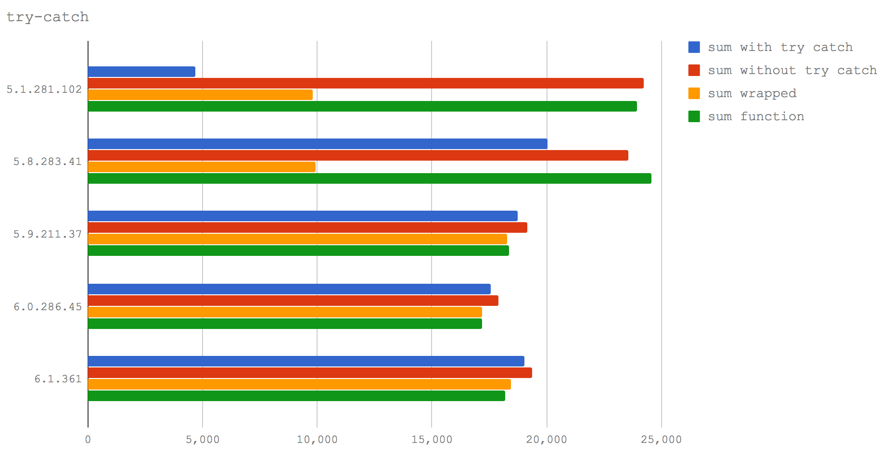

We can see that the existing wisdom around `try/catch` causing performance problems is true
in Node 6 (V8 5.1) but has significantly less performance impact in Node 8.0-8.2 (V8 5.8).

Also of note, calling a function from within a `try` block is much slower than calling it from
outside a `try` block - this holds true in both Node 6 (V8 5.1) and Node 8.0-8.2 (V8 5.8).

However for Node 8.3+ the performance hit of calling a function inside a `try` block is negligible.

Nevertheless, don't rest too easy. While working on some performance workshop material,
Matteo and I [found a performance bug](https://bugs.chromium.org/p/v8/issues/detail?id=6576&q=matteo%20collina&colspec=ID%20Type%20Status%20Priority%20Owner%20Summary%20HW%20OS%20Component%20Stars), where a rather specific combination
of circumstances can lead to an infinite deoptimization/reoptimization
cycle in Turbofan (this would count as a "killer" - a pattern that destroys performance).

### Removing properties from objects

For years now, `delete` has been off limits to anyone wishing to write high performance
JavaScript (well at least where we're trying to write optimal code for a hot path).

The problem with `delete` boils down to the way V8 handles the dynamic nature of JavaScript
objects and the (also potentially dynamic) prototype chains that make property lookups
even more complex at an implementation level.

The V8 engine's technique for making property objects high speed is to create a class in the C++
layer based on the "shape" of the object. The shape is essentially what keys and values a property
has (including the prototype chain keys and values). These are known as "hidden classes". However,
this is an optimization that occurs on objects at runtime, if there's uncertainty about the shape
of the object V8 has another mode for property retrieval: hash table lookup. The hash table lookup is
significantly slower. Historically, when we `delete` a key from the object subsequent property access
will be a hash table look up. This is why we avoid `delete` and instead set properties to `undefined`
which leads to the same result as far as values are concerned but may be problematic when checking for
property existence; however it's often good enough for pre-serialization redaction because `JSON.stringify`
does not include `undefined` values in its output (`undefined` isn't a valid value in the JSON specification).

Now, let's see if the newer Turbofan implementation addresses the `delete` problem.

In this microbenchmark we compare two cases:

* serializing an object after an object's property has been set to `undefined`
* serializing an object after `delete` has been used to remove an object's property

**Code:** <https://github.com/davidmarkclements/v8-perf/blob/master/bench/property-removal.js>

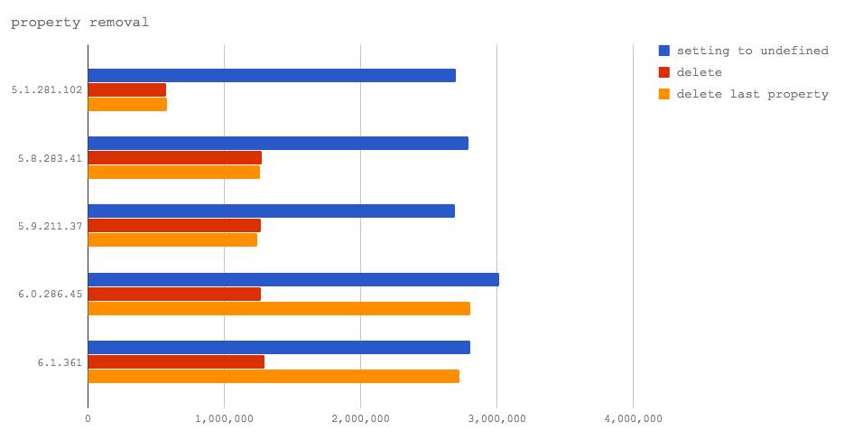

In V8 6.1 (not yet used in any Node releases), operations on an object with a deleted property gets *extremeley* fast,
faster, even, than setting to `undefined`. This is excellent news because now we can do
the right thing *and* it's the fastest option.

### Leaking and arrayifying `arguments`

A common problem with the implicit `arguments` object available to normal JavaScript functions (as opposed to
fat arrow functions which do not have `arguments` objects) is that it's array-like but *not* an array.

In order to use array methods or most array behavior, the indexing properties of the `arguments` object have
be copied to an array. In the past JavaScripters have had a propensity towards equating *less code* with
*faster* code. Whilst this rule of thumb yields a payload-size benefit for browser-side code, the same rule
can cause pain on the server side where code size is far less important than execution speed. So a seductively terse
way to convert the `arguments` object to an array became quite popular: `Array.prototype.slice.call(arguments)`.
This calls the Array `slice` method passing the `arguments` object as the `this` context of that method,
the `slice` method sees an object that quacks like an array and acts accordingly. That is, it takes a slice of
the entire arguments array-like object as an array.

However when a function's implicit `arguments` object is exposed from the functions context
(for instance, when it's returned from the function or passed into another function as in the case of
`Array.prototype.slice.call(arguments)`) this typically causes performance degradation. Now it's time
to challenge that assumption.

This next microbenchmark measures two interrelated topics across our four V8 versions: the cost of leaking `arguments`
and the cost of copying arguments into an array (which is subsequently exposed from the function scope in place of the `arguments` object).

Here's our cases in detail:

* Exposing the `arguments` object to another function - no array conversion (*leaky arguments*)
* Making a copy of the `arguments` object using the `Array.prototype.slice` tricks (*Array prototype.slice arguments*)
* Using a for loop and copying each property across (*for-loop copy arguments*)
* Using the EcmaScript 2015 spread operator to assign an array of inputs to a reference (*spread operator*)

**Code:** <https://github.com/davidmarkclements/v8-perf/blob/master/bench/arguments.js>

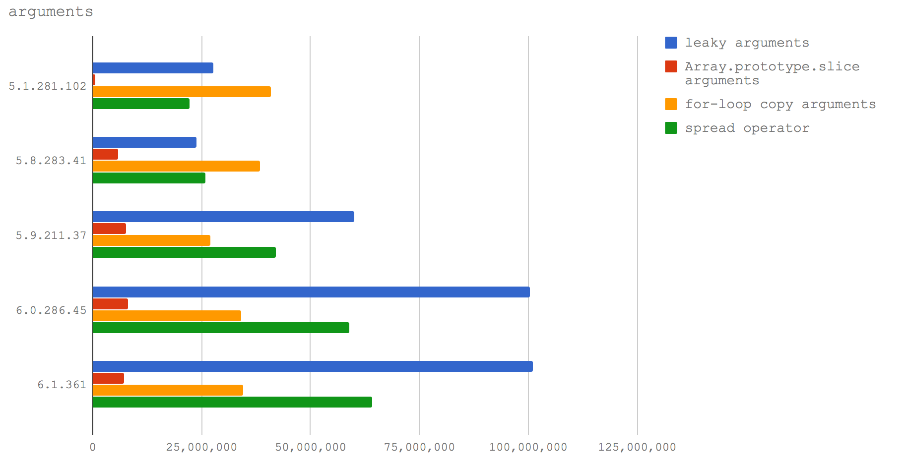

Let's take a look at the same data in line graph form to emphasise the change in performance characteristics:

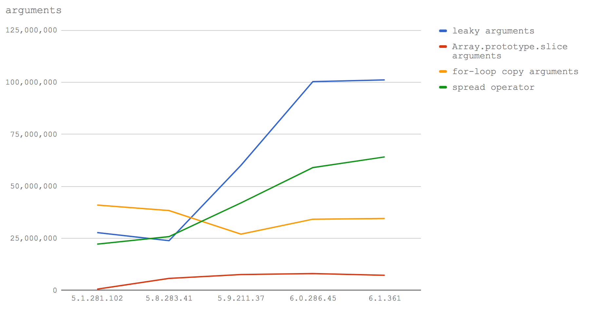

Here's the takeaway: if we want to write performant code around processing function inputs as an array
(which in my experience seems fairly common), then in Node 8.3 and up we should use the spread operator.
In Node 8.2 and down we should use a for loop to copy the keys from `arguments` into a new (pre-allocated)
array (see the benchmark code for details).

Further in Node 8.3+ we won't be punished for exposing the `arguments` object to other functions,
so there may be further performance benefits in cases where we don't need a full array and can make do
with an array-like structure.

### Partial application (currying) and binding

Partial application (or currying) refers to the way we can capture state in nested closure scopes.

For instance:

```js
function add (a, b) {
  return a + b
}
const add10 = function (n) {
  return add(10, n)
}
console.log(add10(20))
```

Here the `a` parameter of `add` is partially applied as the value `10` in the `add10` function.

A terser form of partial application was made available with the `bind` method since EcmaScript 5:

```js
function add (a, b) {
  return a + b
}
const add10 = add.bind(null, 10)
console.log(add10(20))
```

However, we would typically not use `bind` because is demonstrably slower than using a closure.

This benchmark measures the difference between `bind` and closure over our target V8 versions,
with direct function calls as the control.

Here's our four cases:

* a function that calls another function with the first argument partially applied (*curry*)
* a fat arrow function that calls another function with the first argument partially applied (*fat arrow curry*)
* a function that is created via `bind` that partially applies the first argument of another function (*bind*)
* a direct call to a function without any partial application (*direct call*)

**Code:** <https://github.com/davidmarkclements/v8-perf/blob/master/bench/currying.js>

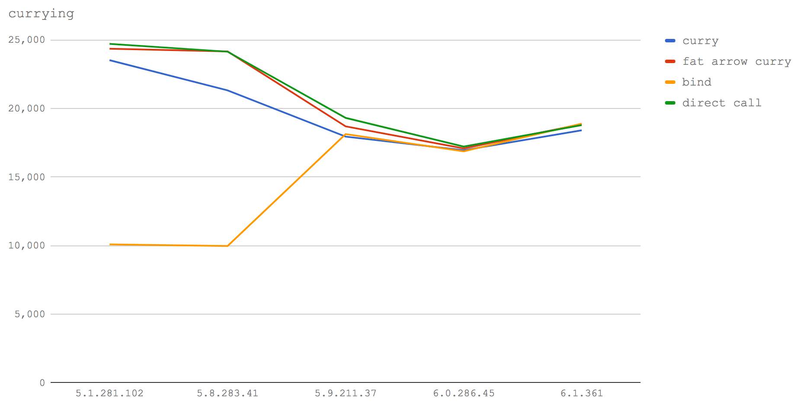

The line graph visualization of this benchmark's results clearly illustrates how the
approaches converge in later versions of V8. Interestingly, partial application
using fat arrow functions is *significantly* faster than using normal functions (at
least in our microbenchmark case). In fact it almost traces the performance profile
of making a direct call. In V8 5.1 (Node 6) and 5.8 (Node 8.0-8.2) `bind` is
very slow by comparison, and it seems clear that using fat arrows for partial application
is the fastest option. However `bind` speeds up by an order of magnitude
from V8 version 5.9 (Node 8.3+) becoming the fastest approach (by an almost negligible amount)
in version 6.1 (future Node).

The fastest approach to currying over all versions is using fat arrow functions. Code using
fat arrow functions in later versions will be as close to using `bind` as makes no odds, and
currently it's faster than using normal functions. However, as a caveat, we probably need to investigate more types
of partial application with differently sized data structures to get a fuller picture.

### Function character count

The size of a function, including it's signature, the white space and even comments can affect
whether the function can be inlined by V8 or not. Yes: adding a comment to your function
may cause a performance hit somewhere in the range of a 10% speed reduction. Will this change with Turbofan? Let's find out.

In this benchmark we look at three scenarios:

* a call to a small function (*sum small function*)
* the operations of a small function performed inline, padded out with comments (*long all together*)
* a call to a big function that has been padded with comments (*sum long function*)

**Code:** <https://github.com/davidmarkclements/v8-perf/blob/master/bench/function-size.js>

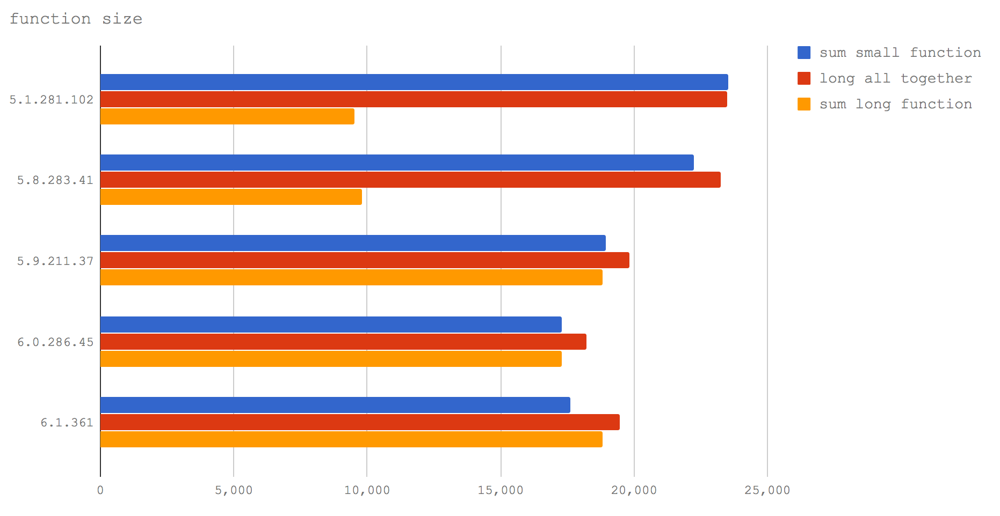

In V8 5.1 (Node 6) *sum small function* and *long all together* are equal. This perfectly illustrates how
inlining works. When we're calling the small function, it's as if V8 writes the contents of the
small function into the place it's called from. So when we actually write the contents of a function
(even with the extra comment padding), we've manually inlined those operations and the performance is
equivalent. Again we can see in V8 5.1 (Node 6) that calling a function that is padded with comments which
take it past a certain size, leads to much slower execution.

In Node 8.0-8.2 (V8 5.8) the situation is pretty much the same, except the cost of calling the small
function has noticeably increased; this may be due to the smushing together of Crankshaft and Turbofan
elements whereas one function may be in Crankshaft the other may be in Turbofan causing disjoints in
inlining abilities (i.e. there has to be a jump between clusters of serially inlined functions).

In 5.9 and upwards (Node 8.3+), any size added by irrelevant characters such as whitespace or comments
has no bearing on the functions performance.
This is because Turbofan uses the functions AST ([Abstract Syntax
Tree](https://en.wikipedia.org/wiki/Abstract_syntax_tree) node count to
determine function size, rather than using character count as in
Crankshaft. Instead of checking byte count of a function, it consider
the actual instructions of the function, so that from V8 5.9 (Node 8.3+)
**whitespace, variable name character count, function signatures and
comments no longer factors in whether a function will inline.**

Notably, again, we see that overall performance of functions decreases.

The takeaway here should still be to keep functions small. At the moment we still have to avoid
over-commenting (and even whitespace) inside functions. Also if you want the absolute fastest speed,
manually inlining (removing the call) is consistently the fastest approach. Of course this has to be balanced
against the fact that after a certain size (of actually executable code) a function won't be inlined, so copy-pasting
code from other functions into your function could cause performance problem. In other words manual
inlining is a potential footgun; it's better to leave inlining up to the compiler in most cases.

### 32bit vs 64bit integers

It's rather well known that JavaScript only has one number type: `Number`. (Maybe a sentence about the BigInt proposal should be included here?)

However, V8 is implemented in C++ so a choice has to be made
on the underlying type for a numeric JavaScript value.

In the case of integers (that is, when we specify a number in JS without a decimal),
V8 assumes that all numbers are 32bit - until they aren't. This seems like a fair choice,
since in many cases a number is within the 0-65535 range. If a JavaScript (whole) number
exceeds 65535 the JIT Compiler has to dynamically alter the underlying type for the number
to 64bit - this may also have potential knock on effects with regards to other optimizations.

This benchmark looks at three cases:

* a function handling only numbers in the 32bit range (*sum small*)
* a function handling a combination of 32bit and 64bit numbers (*from small to big*)
* a function handling only numbers that exceed 32bit capacity (*all big*)

**Code:** <https://github.com/davidmarkclements/v8-perf/blob/master/bench/numbers.js>

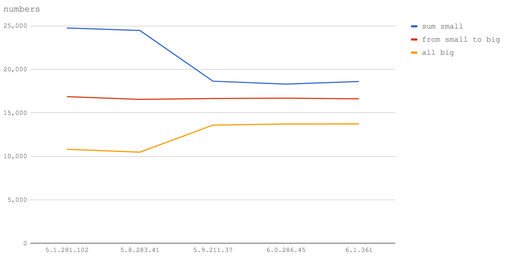

We can see from the graph that whether it's Node 6 (V8 5.1) or Node 8 (V8 5.8)
or even some future version of Node this observation holds true. Numbers (integers)
greater than 65535 will cause functions to run between a half and two thirds of the speed.
So, if you have long numeric ID's - put them in strings.

It's also quite noticeable that numbers in the 32bit range have a speed increase between
Node 6 (V8 5.1) and Node 8.1 and 8.2 (V8 5.8) but slow significantly in Node 8.3+ (V8 5.9+).
Since the large numbers don't change speed at all, it's likely that this genuinely is a slow-down
in (32bit) number handling rather than being related to the speed of function calls or
for loops (which are used in the benchmark code).

### Iterating over objects

Grabbing all of an objects values (properties?) and doing something with them is a common task
and there are many ways to approach this. Let's find out which is fastest across
our V8 (and Node) versions.

This benchmark measures four cases for all V8 versions benched:

* using a `for`-`in` loop with a `hasOwnProperty` check to get an objects values (*for in*)
* using `Object.keys` and iterating over the keys using the Array `reduce` method, accessing the object values
inside the iterator function supplied to `reduce` (*Object.keys functional*)
* using `Object.keys` and iterating over the keys using the Array `reduce` method, accessing the object values
inside the iterator function supplied to `reduce` where the iterator function is a fat arrow function (*Object.keys functional with arrow*)
* looping over the array returned from `Object.keys` with a `for` loop, accessing the object values within the loop (*Object.keys with for loop*)

We also benchmarks an additional three cases for V8 5.8, 5.9, 6.0 and 6.1

* using `Object.values` and iterating over the values using the Array `reduce` method, (*Object.values functional*)
* using `Object.values` and iterating over the values using the Array `reduce` method, where the iterator function
supplied to `reduce` is a fat arrow function (*Object.values functional with arrow*)
* looping over the array returned from `Object.values` with a `for` loop (*Object.values with for loop*)

We don't bench these cases in V8 5.1 (Node 6) because it doesn't support the native EcmaScript 2015 `Object.values` method.

**Code:** <https://github.com/davidmarkclements/v8-perf/blob/master/bench/object-iteration.js>

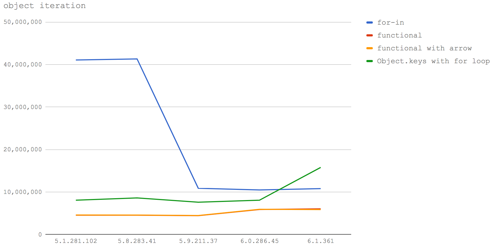

In Node 6 (V8 5.1) and Node 8.0-8.2 (V8 5.8) using `for`-`in` is by far the fastest way to loop over an object's keys,
then access the values of the object. At roughly 40 million operations per second, it's 5 times faster than
the next closest approach which is `Object.keys` at around 8 million op/s.

In V8 6.0 (Node 8.3) something happens to `for`-`in` and it cuts down to one quarter the speed of
former versions, but is still faster than any other approach.

In V8 6.1 (the future of Node), the speed of `Object.keys` leaps forward and becomes faster than
using `for`-`in` - but no where near the speed of `for`-`in` in V8 5.1 and 5.8 (Node 6, Node 8.0-8.2).

A driving principle behind Turbofan seems to be to optimize for intuitive coding behavior. That is,
optimize for the case that is most ergonomic for the developer.

Using `Object.values` to get values directly is slower than using `Object.keys` and accessing
the values in the object. On top of that, procedural loops remain faster than functional programming.
So there may be some more work to do when it comes to iterating over objects.

Also, for those who've used `for`-`in` for its performance benefits it's going to be a painful
moment when we lose a large chunk of speed with no alternative approach available.

### Creating objects

We create objects *all the time* so this is a great area to measure.

We're going to look at three cases:

* creating objects using object literals (*literal*)
* creating objects from an EcmaScript 2015 Class (*class*)
* creating objects from a constructor function (*constructor*)

**Code:** <https://github.com/davidmarkclements/v8-perf/blob/master/bench/object-creation.js>

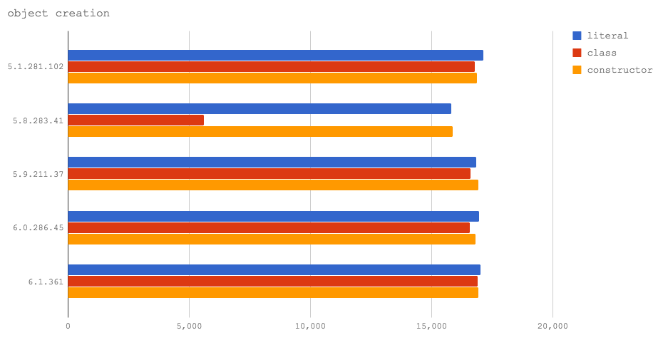

In Node 6 (V8 5.1) all approaches are pretty even.

In Node 8.0-8.2 (V8 5.8) instances created from EcmaScript 2015 classes are less than half
the speed of using an object literal of a constructor. So.. you know, watch out for that.

In V8 5.9 performance evens out again.

Then in V8 6.0 (hopefully Node 8.3, or otherwise 8.4) and 6.1 (which isn't currently in any Node release) object creation
speed goes *insane*!! Over 500 million op/s! That's incredible.


We can see that objects created by constructors are slightly slower. So our best bet
for future friendly performant code is to always prefer object literals. This suits us fine,
since we recommend returning object literals from functions (rather than using classes
or constructors) as a general best coding practice.


### Polymorphic vs monomorphic functions

When we always input the same type of argument into a function (say, we always pass a string), we are using that function
in a monomorphic way. Some functions are written to be polymorphic - which means that the same parameter can be handled
as different hidden classes - so maybe it can handle a string, or an array or an object with a specific hidden class and
handle it accordingly. This can make for nice interfaces in some circumstances but has a negative impact on performance.

Let's see how monomorphic and polymorphic cases do in our benchmarks.

Here we investigate five cases:

* a function is passed both object literals and strings (*polymorphic with literal*)
* a function is passed both constructor instances and strings (*polymorphic with constructor*)
* a function is only passed strings (*monomorphic string*)
* a function is only passed object literals (*monomorphic obj literal*)
* a function is only passed constructor instances (*monomorphic obj with constructor*)

**Code:** <https://github.com/davidmarkclements/v8-perf/blob/master/bench/polymorphic.js>


The data visualized in our graph shows conclusively that monomorphic functions outperform polymorphic functions
across all V8 versions tested.

There's a much wider performance gap between monomorphic and polymorphic functions in V8 6.1 (future Node),
which compounds the point further. However it's worth noting that this based on the node-v8 branch which 
uses a sort of nightly-build V8 version - it may not end up being a concrete characteristic in V8 6.1.   

If we're writing code that needs to be optimal, that is a function that will be called many times over,
then we should avoid using polymorphism. On the other hand, if it's only called once or twice, say an instantiating/setup function,
then a polymorphic API is acceptable.

### The `debugger` keyword

Finally, let's talk about the `debugger` keyword.

Be sure to strip `debugger` statements from your code. Stray `debugger` statements destroy performance.

We're looking at two cases:

* a function that contains the `debugger` keyword (*with debugger*)
* a function that does not contain the `debugger` keyword (*without debugger*)

**Code:** <https://github.com/davidmarkclements/v8-perf/blob/master/bench/debugger.js>

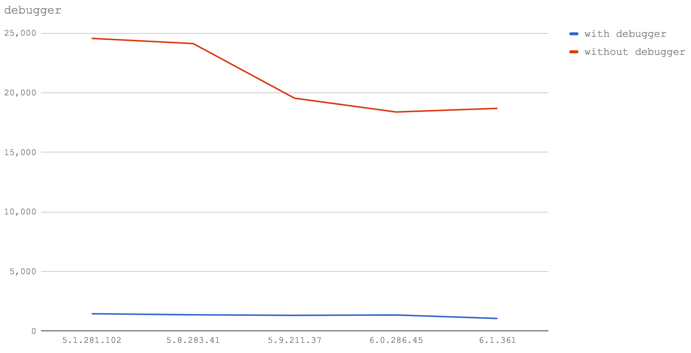

Yep. Just the presence of the `debugger` keyword is terrible for performance
across all V8 versions tested.

The *without debugger* line noticeably drops over successive V8 versions, we'll talk about this in the [Summary](#summary).

### A real world benchmark: Logger comparison

In addition to our microbenchmarks we can take a look at the holistic effects of our
V8 versions by using benchmarks of most popular loggers for Node.js that Matteo and I
put together while we were creating [Pino](http://getpino.io).

The following bar chart represent the performance of the most popular
loggers in Node.js 5.9 (Crankshaft):

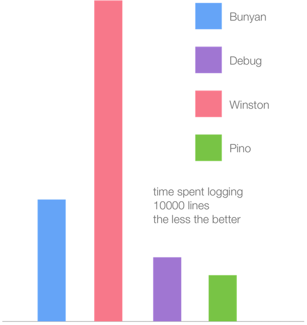

While the following is the same benchmarks using V8 6.1 (Turbofan):


While all of the logger benchmarks improve in speed (by roughly 2x), the Winston logger derives the
most benefit from the new Turbofan JIT compiler. This seems to demonstrate the speed convergence 
we see among various approaches in our microbenchmarks: the slower approaches in Crankshaft 
are significantly faster in Turbofan while the fast approaches in Crankshaft tend get a little slower Turbofan. 
Winston, being the slowest, is likely using the approaches which are slower in Crankshaft but much faster 
in Turbofan whereas Pino is optimized to use the fastest Crankshaft approaches. While a speed increase 
is observed in Pino, it's to a much lesser degree.  

### Summary

Some of the benchmarks show that while slow cases in V8 5.1, V8 5.8 and 5.9 become faster with the advent of full Turbofan enablement
in V8 6.0 and V8 6.1, the fast cases also slow down, often matching the increased speed of the slow cases.

Much of this is due to the cost of making function calls in Turbofan (V8 6.0 and up). The idea behind
Turbofan was to optimize for common cases and eliminate commonly used "V8 Killers". This has resulted in a net performance benefit for (Chrome) browser and
server (Node) applications. The trade-off appears to be (at least initially) a speed decrease
for the most performant cases. Our logger benchmark comparison indicates that the general net effect 
of Turbofan characteristics is comprehensive performance improvements even across significantly 
contrasting code bases (e.g. Winston vs Pino).  

If you've had an eye on JavaScript performance for a while, and adapted coding behaviors to the quirks
of the underlying engine it's nearly time to unlearn some techniques. If you've focused on best practices,
writing generally *good* JavaScript then well done, thanks to the V8 team's tireless efforts,
a performance reward is coming.

---

The raw data for this article can be found at: https://docs.google.com/spreadsheets/d/1mDt4jDpN_Am7uckBbnxltjROI9hSu6crf9tOa2YnSog/edit?usp=sharing

